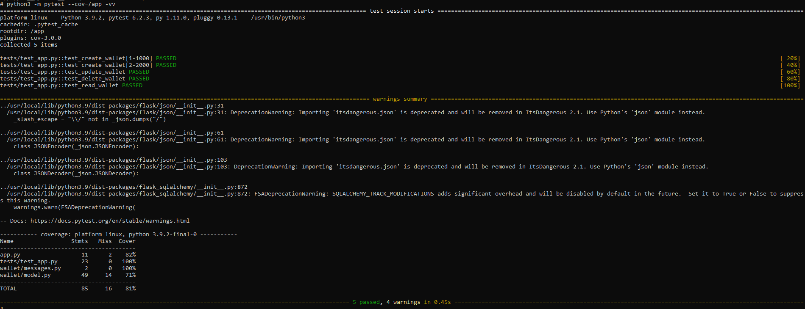

## Descripción
El objetivo del código es mostrar un proyecto simple de Python con las siguientes caracterísitcas en un nivel básico:
- Uso de contenedor para su implementación
- Uso de Framework Flask
- Pruebas unitarias
- Ejemplo de excepción
- Ejemplo de logs


## Docker
Para la creación de la imagen, desde la carpeta del archivo dockerfile, docker utilizar el comando:
```
docker build -t wallet .
```

Para la ejecución usar el comando:
```
docker run -i -p 5000:5000 -p 5432:5432 --name wallet-example wallet
```

## Python
Para la ejecución de la APP, desde la carpeta /app, utilizar el comando:
```
python3 app.py
```

## Pruebas
Desde la carpeta CPEX\Wallet, ejecutar el comando:
```
python3 -m pytest
```

### Covertura de código

```
python3 -m pytest --cov=/app -vv
```

Ejemplo:
 
